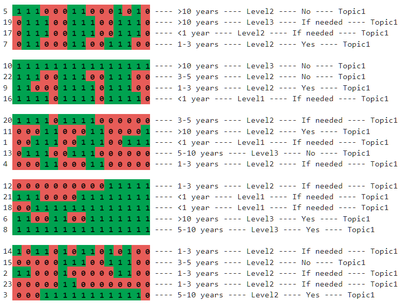

---
hide:
  - toc
---

# Results

SAAT provides some utility functions to help processing and QA of results.  Firstly we can inspect the raw state SAAT found and it's energy:

```py
print('Allocation: ' + str(state))
print('Energy maximised at: ' + str(-e))
```

```
Allocation: [5, 19, 17, 7, 10, 22, 9, 16, 20, 11, 1, 13, 4, 12, 21, 18, 6, 8, 14, 15, 2, 23, 3]
Energy maximised at: 7.737247474747475
```

<font size='2'> Note, energy: e, is a negative number which SimAnneal minimises (this is equivalent to maximising -e) </font>

It also has a function for printing a pretty version of the final allocation.  

```py
utils.print_pretty_allocations(
    state = state, 
    times = data.loc[:,'1-2pm':'5-6pm3'], 
    group_size = 4,
    extras = data.iloc[:,2:6])
```



Lastly, it can print the results to csv to be opened in Excel and easily shared:

```py
utils.results_to_csv(
    state = state,
    data = data,
    group_size = 4,
    name='results/Topic_1_Allocation.csv')
```